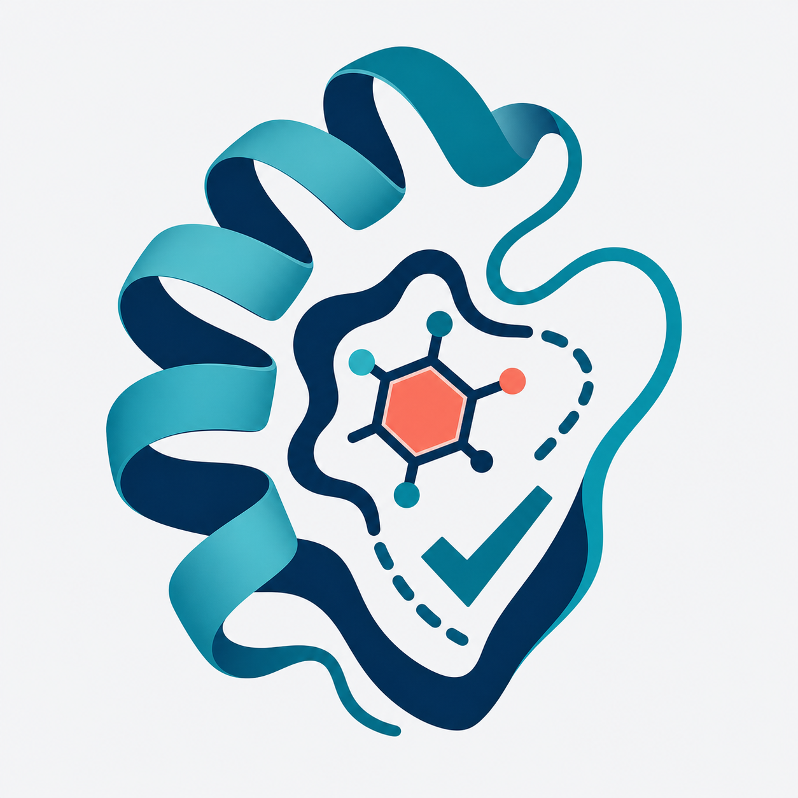
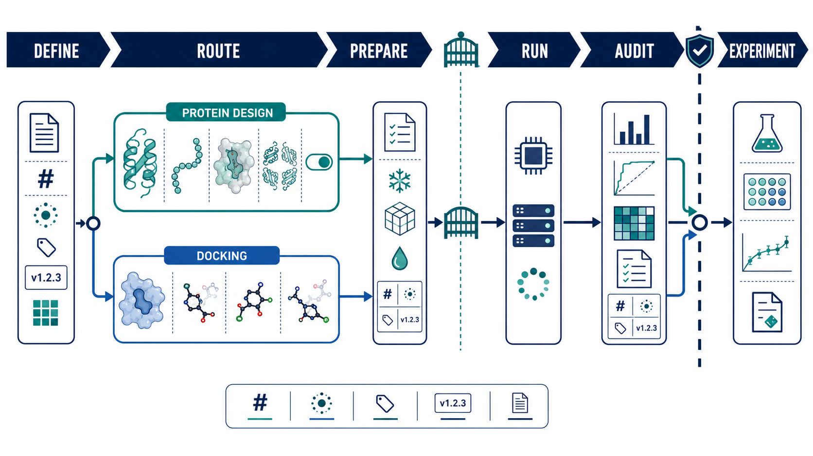
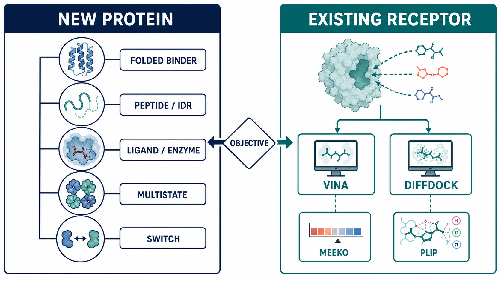
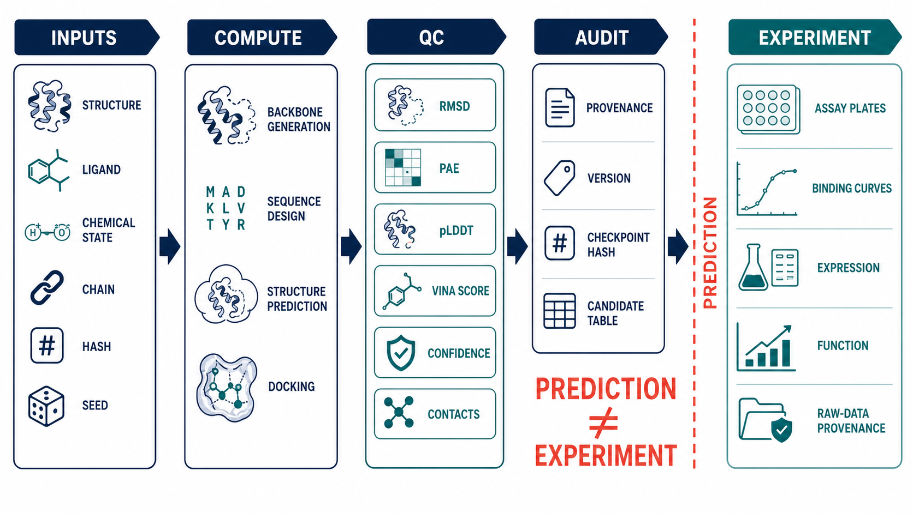

<p align="center">
  
</p>

<h1 align="center">Design Dock Skills</h1>

<p align="center">
  面向 Codex 的蛋白设计与分子对接 skill：把任务路由、输入质检、运行准备、受控执行和证据审计放进同一套可追踪清单。
</p>

<p align="center">
  <a href="https://github.com/luvega/design_dock_skills/actions/workflows/tests.yml"></a>
  
  
</p>

`baker-protein-design` 适合需要可审计计算流程的蛋白设计人员、结构生物信息学研究者和药物设计团队。它支持五类新蛋白设计任务，以及既有受体—小分子的 pose prediction、redocking 和 target-focused screening。仓库不打包论文全文、微信材料、外部代码、模型权重或真实结构数据。

> 当前实现的重点是规划、输入检查、运行清单和结果审计。重模型、AutoDock Vina、Meeko、PLIP、PyMOL 或自托管 DiffDock 需要用户另行配置合法环境。缺少真实输入、版本、许可、哈希、seed 或运行授权时，`run` 会阻断。

## 导航

- [工作流程](#工作流程)
- [方法归类](#方法归类)
- [输入与输出](#输入与输出)
- [安装与快速使用](#安装与快速使用)
- [测试数据](#测试数据)
- [评价标准](#评价标准)
- [方法与来源](#方法与来源)
- [安全与证据边界](#安全与证据边界)
- [项目结构](#项目结构)

## 工作流程



Skill 提供五种模式：

| 模式 | 用途 | 是否执行模型或对接 |
|---|---|---:|
| `route` | 根据研究目标选择路线，列出仍缺的生物学、化学和算力信息 | 否 |
| `plan` | 形成分阶段、可引用的方法方案 | 否 |
| `prepare` | 校验并哈希本地输入，生成清单、候选表和待审核命令 | 否 |
| `run` | 通过严格预检后，执行已经审阅的 `argv` 数组 | 条件式 |
| `audit` | 检查输入哈希、工具版本、许可、seed、输出锚点和证据措辞 | 否 |

`run` 不是默认模式。对接子进程使用 `shell=false`；Hosted DiffDock 还要求显式上传授权、`public` 或 `non-sensitive` 数据分类，以及仅从环境变量读取的新 `NVIDIA_API_KEY`。

## 方法归类



先回答“要设计新蛋白，还是评估既有受体—配体 pose”。这条边界决定后续方法，不能只看到输入中有 ligand 就自动选择对接。

| 路线 | 研究问题 | 典型计算阶段 | 主要输入 | 主要输出 |
|---|---|---|---|---|
| `folded-target-binder` | 为折叠蛋白表面或平坦 PPI 设计新 binder | target-conditioned backbone generation → sequence design → complex prediction → counter-screen | 明确装配体、链、表位/hotspot、valency、negative targets | 设计骨架、序列、界面预测、来源化筛选表 |
| `peptide-idr-binder` | 为肽、IDR、IDP 或柔性螺旋设计新 binder | flexible-target generation → sequence design → ensemble prediction | 靶肽/IDR 状态、允许的构象选择、scrambled/homolog controls | 候选 binder、构象假设、交叉特异性实验计划 |
| `small-molecule-enzyme` | 围绕 ligand、substrate、metal 或 catalytic geometry 设计新蛋白 | all-atom/active-site generation → LigandMPNN → local geometry/whole-structure QC | 化学状态、原子命名、口袋或反应坐标几何 | 新蛋白骨架、序列、局部几何和结构预测 |
| `multistate-oligomer` | 设计由多状态、对称性或装配体决定功能的新蛋白 | multistate generation → state-specific scoring | 每个正/负状态、stoichiometry、symmetry、允许的构象变化 | 同一序列的分状态预测与审计 |
| `allosteric-switch` | 构建 ligand-dependent 输出系统 | receptor design → insertion/fusion library → ON/OFF selection | receptor、reporter、动态范围、连接和方向约束 | 设计与实验库方案；计算不能单独证明 switch |
| `molecular-docking-screen` | 为既有受体与 ligand 生成或复现 pose | receptor/ligand preparation → Vina 或 DiffDock → protocol QC | 受体状态、chemical-state ID、site/grid 或上传授权、seed、controls | pose、协议相关评分、pose confidence、审计报告 |

各路线的完整契约位于 [`skills/baker-protein-design/references/`](skills/baker-protein-design/references/)。

### 计算阶段不能混写

| 阶段 | 回答的问题 | 常用工具 | 不能据此声称 |
|---|---|---|---|
| Backbone generation | 是否得到满足几何约束的候选骨架 | RFdiffusion、RFdiffusion All-Atom、CA_RFDiffusion | 已获得稳定、可表达或有功能的蛋白 |
| Sequence design | 哪些序列与给定骨架/原子环境相容 | ProteinMPNN、LigandMPNN | 已验证亲和力、选择性或催化活性 |
| Structure prediction/QC | 序列是否回折、复合物或局部几何是否自洽 | RFAA、其他声明的预测器、PLACER | 已经通过实验结构或功能验证 |
| Molecular docking | 既有 ligand 在既有 receptor 上可能采用什么 pose | AutoDock Vina、DiffDock | Vina score 是实验自由能；DiffDock confidence 可跨 ligand 排名 |
| Interaction annotation | 给定 pose 中有哪些预测接触 | PLIP | 接触已被实验确认或解释了作用机制 |
| Experiment | 表达、结合、特异性、结构、催化或功能是否成立 | 项目定义的实验体系 | 无原始数据和样本来源时不得标为 `current_experimental` |

## 输入与输出

### 蛋白设计输入

使用 [`design_request.example.yaml`](skills/baker-protein-design/assets/design_request.example.yaml) 作为结构模板，至少记录：

- `design_goal`、机制和功能 readouts；
- 靶标结构、装配体、链、构象状态、hotspot 或 motif；
- ligand/metal/covalent state、固定位置、长度和对称性约束；
- negative targets、实验 controls 和 valency；
- 计算后端、工具仓库、commit、许可、checkpoint SHA-256；
- seed、候选规模和带论文 locator 的阶段性筛选参数。

### 对接输入

使用 [`docking_request.example.yaml`](skills/baker-protein-design/assets/docking_request.example.yaml) 和 [`docking_batch_template.csv`](skills/baker-protein-design/assets/docking_batch_template.csv)。严格运行要求：

- `objective`: `pose-prediction`、`redocking` 或 `target-focused-screen`；
- `engine`: `autodock-vina`、`diffdock-nim-hosted` 或 `diffdock-nim-self-hosted`；
- 受体装配体、链、生物学状态、突变、质子化、缺失残基、altloc 和逐类 HETATM 决策；
- 每个 ligand 的稳定小写 `ligand_id` 和 `chemical_state_id`；
- Vina 的可追踪 grid 来源与坐标，或 Hosted DiffDock 的上传授权；
- seed、pose 数量、controls，以及 redocking 的 reference pose、atom mapping、symmetry 和 RMSD 协议。

`[0, 0, 0]` 只有在记录的来源确实推导出零坐标时才合法，不能用作“尚未填写”的默认值。

### 标准输出

| 文件 | 内容 |
|---|---|
| `design_brief.md` | 研究目标、路线、关键选择和未解决问题 |
| `target_manifest.yaml` | 靶标、链、状态、化学状态和输入锚点 |
| `run_manifest.yaml` | schema、输入哈希、工具/权重、参数、seed、后端、命令摘要和证据状态 |
| `commands.sh` | 蛋白设计后端的待审阅命令 |
| `commands.ps1` | 对接流程的待审阅命令 |
| `candidates.csv` | 蛋白设计候选及其证据状态 |
| `docking_candidates.csv` | receptor state × ligand state × seed × pose 的结果表 |
| `docking_report.md` | 对接协议、运行状态、指标解释和失败原因 |
| `audit_report.md` | 哈希、版本、许可、输出锚点和措辞审计 |

[`run_manifest.template.yaml`](skills/baker-protein-design/assets/run_manifest.template.yaml) 展示 schema `1.1` 的输出形状；实现继续接受字符串版本 `1.0`。

## 安装与快速使用

### 安装为 Codex skill

```powershell
git clone https://github.com/luvega/design_dock_skills.git
Set-Location design_dock_skills

$target = (Resolve-Path ".\skills\baker-protein-design").Path
$link = Join-Path $env:USERPROFILE ".codex\skills\baker-protein-design"
New-Item -ItemType Junction -Path $link -Target $target
```

如果 `$link` 已存在，先检查它的目标；不要覆盖另一份正在使用的 skill。建立联接后新开一个 Codex 会话，使用：

```text
Use $baker-protein-design 根据我的靶点、配体、功能目标与算力生成可审计的蛋白设计或分子对接流程。
```

### CLI：生成规划包

```powershell
$env:PYTHONDONTWRITEBYTECODE = "1"

python .\skills\baker-protein-design\scripts\baker_design.py plan `
  --request .\skills\baker-protein-design\assets\design_request.example.yaml `
  --output .\work\folded-binder-plan
```

对接示例有意保留 `planning_only` 和 `REPLACE` 占位符。`prepare` 可以据此报告缺项，严格 `run` 必须阻断：

```powershell
python .\skills\baker-protein-design\scripts\baker_design.py prepare `
  --request .\skills\baker-protein-design\assets\docking_request.example.yaml `
  --output .\work\4wkq-redocking-prepare
```

审计已有 package：

```powershell
python .\skills\baker-protein-design\scripts\baker_design.py audit `
  --manifest .\work\4wkq-redocking-prepare\run_manifest.yaml
```

`run --execute` 只适用于已替换全部占位符、通过严格预检并确认工具/服务许可的 package。本项目不会自动执行 `conda create`、`pip install`、`git clone` 或权重下载。

## 测试数据

仓库只提供合成、规划级或外部链接型测试材料，不分发真实 PDB/SDF、论文附件或模型权重。

| 测试材料 | 位置 | 用途 | 证据状态 |
|---|---|---|---|
| 蛋白设计请求模板 | [`design_request.example.yaml`](skills/baker-protein-design/assets/design_request.example.yaml) | 路由、manifest 和缺失 checkpoint/commit 检查 | `planning_only` |
| 4WKQ–gefitinib redocking 请求 | [`docking_request.example.yaml`](skills/baker-protein-design/assets/docking_request.example.yaml) | 受体状态、grid、seed、mapping 和 RMSD 契约 | `planning_only` |
| Batch ligand manifest | [`docking_batch_template.csv`](skills/baker-protein-design/assets/docking_batch_template.csv) | stable ID 和 chemical-state schema | 模板 |
| 50-ligand synthetic manifest | [`examples/test-data/ligands-50.synthetic.csv`](examples/test-data/ligands-50.synthetic.csv) | Hosted DiffDock batch 规划与缺失文件阻断 | 合成；不可运行 |
| Minimal Vina output | [`examples/test-data/vina-two-pose.synthetic.pdbqt`](examples/test-data/vina-two-pose.synthetic.pdbqt) | `REMARK VINA RESULT` 解析 | 合成；非分子结果 |
| Candidate output example | [`examples/test-data/docking-candidates.synthetic.csv`](examples/test-data/docking-candidates.synthetic.csv) | 结果表字段、rank scope 和证据措辞 | 合成；`not-tested` |
| RCSB 4WKQ | [RCSB entry](https://www.rcsb.org/structure/4WKQ) | 外部 redocking protocol 示例 | 数据库报告结构；文件未打包 |

当前测试套件共 `84` 项：

- `test_baker_design.py`: 10 项，覆盖路线优先级、8 GB 降级、manifest 与预测/实验措辞；
- `test_docking_workflow.py`: 64 项，覆盖 schema、Vina/DiffDock 适配、安全、输出锚点和失败恢复；
- `test_structure_resolver.py`: 10 项，覆盖显式 PDB/UniProt 标识符和离线默认行为。

运行：

```powershell
$env:PYTHONDONTWRITEBYTECODE = "1"
$env:BAKER_DESIGN_TEST_ALLOW_NETWORK = "0"
python -m unittest discover `
  -s .\skills\baker-protein-design\scripts `
  -p "test_*.py" `
  -v
```

2026-07-24 的本地发布验收结果为 `Ran 84 tests ... OK`。该数字描述软件测试，不是模型 benchmark、pose recovery 成功率或实验验证比例。完整测试设计见 [`docs/testing-and-evaluation.md`](docs/testing-and-evaluation.md)。

## 评价标准



项目按四个层次评价：

1. **工程完整性**：schema、稳定 ID、路径约束、输入 SHA-256、seed、工具版本、许可、checkpoint 和输出锚点齐全。
2. **协议有效性**：受体/配体状态、装配体、grid 或 reference、controls、redocking mapping 与 pose-selection rule 明确。
3. **计算结果解释**：阈值绑定具体论文、任务和阶段；Vina score、DiffDock confidence、PLIP contacts、PAE、RMSD、pLDDT 等保留各自的指标角色。
4. **实验交接**：expression、monodispersity、binding、specificity、structure、catalysis、signaling 或 sensor dynamic range 由明确样本、assay、日期和原始数据支持。

任何单一计算分数都不构成通用成功标准。redocking RMSD 只评价声明协议下的 pose recovery；Vina score 是协议相关排名值；DiffDock confidence 只用于同一 ligand 内的 pose 排序；PLIP 输出是预测几何接触。更多判定规则见 [`docs/testing-and-evaluation.md`](docs/testing-and-evaluation.md)。

## 方法与来源

项目只链接官方仓库、官方服务文档、DOI 页面和 RCSB 条目。下表是核心入口；逐项角色、输入、输出、许可边界和方法论文见 [`docs/methods-and-sources.md`](docs/methods-and-sources.md)。

| 方法/工具 | 官方实现或文档 | 方法论文 |
|---|---|---|
| RFdiffusion | [RosettaCommons/RFdiffusion](https://github.com/RosettaCommons/RFdiffusion) | [Watson et al., 2023](https://doi.org/10.1038/s41586-023-06415-8) |
| ProteinMPNN | [dauparas/ProteinMPNN](https://github.com/dauparas/ProteinMPNN) | [Dauparas et al., 2022](https://doi.org/10.1126/science.add2187) |
| LigandMPNN | [dauparas/LigandMPNN](https://github.com/dauparas/LigandMPNN) | [Dauparas et al., 2025](https://doi.org/10.1038/s41592-025-02626-1) |
| RoseTTAFold All-Atom / RFdiffusionAA | [RFAA](https://github.com/baker-laboratory/RoseTTAFold-All-Atom), [RFdiffusionAA](https://github.com/baker-laboratory/rf_diffusion_all_atom) | [Krishna et al., 2024](https://doi.org/10.1126/science.adl2528) |
| ProteinGenerator | [RosettaCommons/protein_generator](https://github.com/RosettaCommons/protein_generator) | [Lisanza et al., 2024](https://doi.org/10.1038/s41587-024-02395-w) |
| CA_RFDiffusion / PLACER | [CA_RFDiffusion](https://github.com/baker-laboratory/CA_RFDiffusion), [PLACER](https://github.com/baker-laboratory/PLACER) | [Lauko et al., 2025](https://doi.org/10.1126/science.adu2454) |
| AutoDock Vina | [ccsb-scripps/AutoDock-Vina](https://github.com/ccsb-scripps/AutoDock-Vina) | [Trott & Olson, 2010](https://doi.org/10.1002/jcc.21334) |
| DiffDock | [gcorso/DiffDock](https://github.com/gcorso/DiffDock) | [Corso et al., ICLR 2023](https://openreview.net/pdf?id=kKF8_K-mBbS) |
| NVIDIA DiffDock NIM | [API reference](https://docs.api.nvidia.com/nim/reference/mit-diffdock-infer) | 服务与上游 DiffDock 代码/权重分开核对 |
| Meeko | [forlilab/Meeko](https://github.com/forlilab/Meeko) | 作为外部 PDBQT preparation 工具登记；本适配器不执行 |
| PLIP | [pharmai/plip](https://github.com/pharmai/plip) | [Salentin et al., 2015](https://doi.org/10.1093/nar/gkv315) |

论文年代版本、当前代码版本和实际运行版本必须分开记录。仓库中的 [`tool-registry-snapshot.md`](skills/baker-protein-design/references/tool-registry-snapshot.md) 是日期化快照，不是 lockfile。

## 安全与证据边界

- 不自动安装环境、接受条款、下载 gated weights 或调用 hosted service。
- 不把 token 写入 YAML、CSV、命令、日志、响应文件或候选表。
- Hosted DiffDock 仅接受显式授权的 `public`/`non-sensitive` 输入，endpoint 固定为官方当前路径。
- 不按“最低分辨率”自动选择结构；基因检索只列候选，用户必须确认装配体、链、突变和 ligand 状态。
- 不默认删除全部 HETATM；water、ion、cofactor、reference ligand 和其他 heterogen 逐类记录。
- 不把 Vina score 写成实验自由能，不用 DiffDock confidence 跨化合物宣称 hit，不把 PLIP contact 写成机制证据。
- 模型输出保持 `computational_prediction`；只有带样本、assay、日期和原始数据来源的结果才能标为 `current_experimental`。

参见 [`SECURITY.md`](SECURITY.md) 和 [`docs/architecture-and-safety.md`](docs/architecture-and-safety.md)。

## 项目结构

```text
design_dock_skills/
├── README.md
├── docs/
│   ├── assets/
│   ├── architecture-and-safety.md
│   ├── methods-and-sources.md
│   └── testing-and-evaluation.md
├── examples/
│   └── test-data/
├── skills/
│   └── baker-protein-design/
│       ├── SKILL.md
│       ├── agents/openai.yaml
│       ├── assets/
│       ├── references/
│       └── scripts/
└── .github/workflows/tests.yml
```

本地研究语料库、微信推文、论文全文、原 CC skill、迁移源审计、真实结构和历史运行结果受 `.gitignore` 排除，不属于公开发布面。

## 贡献、引用与许可

提交前请运行离线单元测试，并说明改动影响的 route、schema、证据标签和安全边界。贡献要求见 [`CONTRIBUTING.md`](CONTRIBUTING.md)。

本仓库目前没有声明统一的顶层开源许可证。外部仓库、权重、数据库、服务和工具各自适用其许可或条款；链接不表示再分发授权。具体边界见 [`THIRD_PARTY_NOTICES.md`](THIRD_PARTY_NOTICES.md)。

若在研究中使用具体模型或软件，请引用对应方法论文和实际运行版本，不要只引用本仓库。
