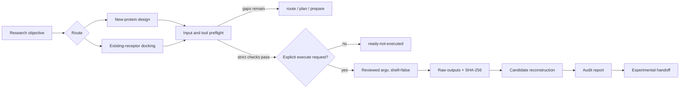

# Architecture and safety model

## 1. Design objective

`baker-protein-design` is a local orchestration and audit layer. It does not replace RFdiffusion, ProteinMPNN, RoseTTAFold All-Atom, AutoDock Vina, DiffDock or experimental validation. Its job is to make the request, inputs, commands, outputs and evidence status inspectable.

The implementation follows three boundaries:

1. Biological and chemical choices are resolved before software selection.
2. Generation, sequence design, structure prediction, docking and experiment remain separate stages.
3. A run requires stronger evidence than a plan: real files, hashes, installed versions, licenses, seeds and backend authorization.

## 2. Control flow



`route`、`plan` 和 `prepare` 可以在算力或工具缺失时使用。`run` 只有在 strict preflight 通过并收到显式执行请求后才进入适配器。

## 3. Adapter status

| Adapter | `plan` / `prepare` | `run` | Current boundary |
|---|---:|---:|---|
| Protein-design command templates | 支持 | 条件式 | 需要真实 repository、commit、license、checkpoint path/hash 和可执行模板 |
| AutoDock Vina | 支持 | 支持 | 仅接收已准备的 PDBQT、显式 grid、seed 和 reviewed argv |
| Hosted DiffDock NIM | 支持 | 支持 | 仅限显式授权、非敏感输入、官方 endpoint 和环境变量凭据 |
| Self-hosted DiffDock NIM | 支持 | 阻断 | `prepare-only`，尚无内置执行 adapter |
| Meeko | 记录外部准备状态 | 阻断 | 本项目不安装或执行 Meeko |
| PLIP | 记录分析请求 | 阻断 | adapter 未实现；结果只能解释为 pose geometry |
| PyMOL | 记录可视化请求 | 阻断 | adapter 未实现；需核对本地发行版许可 |
| Structure resolver | 离线 dry-run | 条件式下载 | 只解析显式 PDB ID/UniProt accession；gene query 不自动选结构 |

## 4. Strict preflight

### Protein design

运行前至少需要：

- 实际存在的结构文件与 SHA-256；
- 装配体、链、构象、生物学状态、hotspot/motif 和 negative targets；
- 工具仓库、commit、许可证；
- checkpoint 文件和 SHA-256；
- seed、候选数、后端和输出根目录；
- 每个数值筛选的来源、locator、任务和阶段。

### Molecular docking

运行前还需要：

- 受体状态 ID、突变、质子化、缺失残基、altloc 和 HETATM 决策；
- 单 ligand 或非空 ligand library；
- 稳定小写 ligand/chemical-state ID；
- Vina 的 grid 来源、center、size、exhaustiveness 和 seed，或 Hosted DiffDock 的上传授权；
- 对应 objective 的 controls；
- redocking 的 reference pose、atom mapping、symmetry handling、alignment、heavy-atom rule、RMSD tool/version 和 pose-selection rule。

严格模式拒绝占位符、错误类型、`NaN`/`Inf`、大小写不规范的 enum/ID、路径逃逸、空 library、冲突 seed 和缺失哈希。

## 5. Command and path safety

- 子进程命令保存为 `argv` 数组并计算计划摘要。
- 执行前重新计算输入哈希，检测 `prepare` 后的文件替换。
- 禁止任意 shell 字符串、`shell=True` 和 `Invoke-Expression`。
- 输出文件必须位于声明的 package root 内。
- Vina 输出使用稳定的 receptor state × ligand state × seed 命名。
- 终态为 blocked、failed 或 completed 时，都会刷新 `audit_report.md` 和 `docking_report.md`。

## 6. Hosted service boundary

Hosted DiffDock 使用当前批准 endpoint：

```text
https://health.api.nvidia.com/v1/molecular-docking/diffdock/generate
```

请求必须同时满足：

- `external_service.authorized: true`；
- `data_classification` 为 `public` 或 `non-sensitive`；
- `credential_rotation_acknowledged: true`；
- `auth_env: NVIDIA_API_KEY`；
- 凭据只存在于当前进程环境；
- 响应和 materialized pose 分别记录路径、字节数和 SHA-256。

HTTP redirect 不自动跟随。响应、header 或错误中出现凭据模式时，数据不会持久化。

## 7. Evidence state

允许的证据标签：

| 标签 | 含义 |
|---|---|
| `planning_only` | 方案或占位输入，未运行 |
| `paper_reported_computational` | 论文报告的计算结果 |
| `paper_reported_experimental` | 论文报告的实验或结构结果 |
| `official_example` | 上游官方示例，未在本地复现 |
| `local_replay_unverified` | 本地执行，但尚未建立等价性或生物学有效性 |
| `computational_prediction` | 当前项目生成、预测或评分的候选 |
| `current_experimental` | 当前项目实验，带样本、assay、日期和原始数据来源 |

标签不能自动升级。高 confidence、低 PAE、低 RMSD 或较优 Vina score 仍是计算证据。

## 8. Public release boundary

公开仓库只包含原创 skill、文档、合成测试材料和生成插图。以下内容保留在本地并由 `.gitignore` 排除：

- 论文全文、supplementary files 和微信推文；
- 原 CC skill、讲义和 vendored repositories；
- Zotero/EndNote 派生索引和本地证据矩阵；
- 真实 PDB/SDF/PDBQT、模型权重和历史运行输出；
- 任何凭据或疑似凭据。
